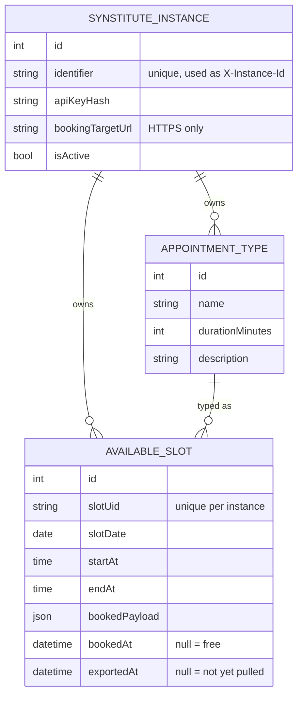
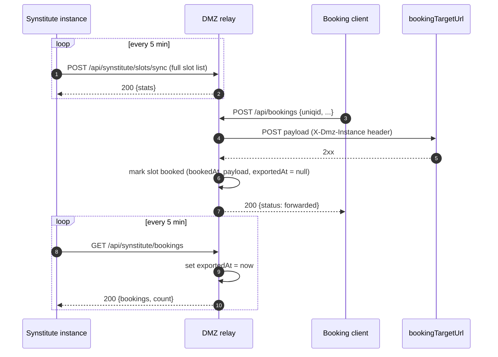

# Slot Synchronisation & Booking Flow

This document describes how available slots move between a **Synstitute instance** (the internal system) and the **DMZ relay**, and how bookings travel back.

## Actors

| Actor | Role |
|---|---|
| **Synstitute instance** | Internal system that owns the calendar. Pushes available slots and pulls bookings. |
| **DMZ relay** (this app) | Publicly reachable buffer. Stores slots, forwards bookings, queues them for pickup. |
| **Booking client** | Frontend/integration that books a slot through the DMZ on behalf of an instance. |
| **Operator** | Person who views bookings in the browser. |

## Data model



A slot's state is derived from `bookedAt` and `exportedAt`:

| `bookedAt` | `exportedAt` | State |
|---|---|---|
| `null` | `null` | **Free**: may be removed by the next sync |
| set | `null` | **Booked, pending export**: returned by the next pull |
| set | set | **Booked, exported**: already delivered to the instance |

## 1. Onboarding an instance

```bash
php bin/console app:instance:create <identifier> <https_booking_target_url>
```

- `identifier`: `[A-Za-z0-9._-]{3,64}`, used as the `X-Instance-Id` header and as the username for the web view.
- `bookingTargetUrl`: must be HTTPS. Bookings are forwarded here.
- The command prints the **API key once**. Only its hash is stored.

The numeric database `id` of the instance is needed for the web view (`/view/bookings/{id}`).

## 2. Authentication (all `/api/*` calls)

Every API request needs these headers:

| Header | Rule |
|---|---|
| `X-Instance-Id` | Instance identifier |
| `X-Api-Key` | API key (24–255 chars) |
| `X-Request-Timestamp` | Unix timestamp (10 digits), max ±300 s drift |
| `X-Request-Id` | `[A-Za-z0-9-]{12,128}`, **unique per request** (replays rejected for 10 min) |
| `Content-Type` | `application/json` for POST requests |

HTTPS is mandatory unless `APP_ENV=dev` **and** `APP_ALLOW_INSECURE=1`.

## 3. End-to-end flow



### 3.1 Slot sync: `POST /api/synstitute/slots/sync`

The body is either `{"slots": [...]}` or a bare array of slots. Max body size: 1 MiB.

```json
{
  "slots": [
    {
      "uniqid": "slot-abc-123",
      "date": "2026-08-03",
      "startAt": "09:00",
      "endAt": "09:30",
      "appointmentType": {
        "string": "Initial consultation",
        "duration": 30,
        "description": "First patient visit"
      }
    }
  ]
}
```

Accepted field variants:

- Slot id: `uniqid` or `slotUid`.
- Appointment type as an object: `string` or `name`, plus `duration` and an optional `description`.
- Appointment type as a string: `"appointmentType": "Initial consultation"` with `duration` and `description` on the slot itself.

**Processing rules** ([SlotSyncService](../src/Service/SlotSyncService.php)):

1. **Validation**: a slot is **silently skipped** if the uid, date (`Y-m-d`), `startAt`/`endAt` (`H:i`), or type name is missing or malformed, or if `duration <= 0`.
2. **Appointment types** are upserted by `(instance, name, duration)`. A changed description is updated. Types are never deleted.
3. **Slots** are upserted by `(instance, slotUid)`. Date, times and type are overwritten on every sync. Booking data is **not** touched.
4. **Removal**: the sync is a **full snapshot**. Free slots (`bookedAt IS NULL`) whose uid is not in the payload are deleted. Booked slots are always kept.

Response:

```json
{ "status": "ok", "stats": { "received": 12, "inserted": 3, "updated": 8 } }
```

`received - inserted - updated` gives the number of skipped (invalid) entries.

> **Important:** if the payload contains **no valid slot** (empty list or all invalid), the removal step is skipped and **existing free slots stay in place**. Sending `[]` does not clear the calendar.

### 3.2 Booking forward: `POST /api/bookings`

The booking client sends any JSON object. It should contain `uniqid` or `slotUid`.

**Processing rules** ([BookingForwarder](../src/Service/BookingForwarder.php)):

1. The target URL must be HTTPS, and all of its DNS A/AAAA records must be public IPs (SSRF protection).
2. The payload is POSTed unchanged to `bookingTargetUrl` with the header `X-Dmz-Instance: <identifier>`. Timeout: 10 s.
3. If the target returns a non-2xx status or is unreachable, the DMZ returns `502 {"error": "Upstream forwarding failed", "upstreamStatus": n}` and **nothing is stored**.
4. On 2xx, if the slot uid exists for this instance, the slot gets `bookedAt = now` and `bookedPayload = payload`, and `exportedAt` is reset to `null`.
5. If the uid is missing or unknown, the booking is still forwarded but **not recorded** in the DMZ.

### 3.3 Booking pull: `GET /api/synstitute/bookings`

- Returns up to **500** booked slots with `exportedAt IS NULL`, oldest booking first.
- Each returned slot is immediately marked `exportedAt = now`.
- If `count` is `500`, call again until `count < 500`.

```json
{
  "bookings": [
    {
      "uniqid": "slot-abc-123",
      "date": "2026-08-03",
      "startAt": "09:00",
      "endAt": "09:30",
      "appointmentType": { "string": "Initial consultation", "duration": 30, "description": "First patient visit" },
      "bookedAt": "2026-08-01T10:15:00+00:00",
      "payload": { "uniqid": "slot-abc-123", "...": "..." }
    }
  ],
  "count": 1
}
```

### 3.4 Web view: `GET /view/bookings/{id}`

- `{id}` is the numeric instance id.
- Login uses the browser prompt (HTTP Basic): username = instance identifier, password = API key.
- An instance can only see its own bookings (otherwise 403). Inactive instances are rejected.
- The page is **read-only**: it lists all booked slots (exported or not) and does **not** change `exportedAt`.

## 4. Recommended Synstitute client behaviour

1. **Every 5 min, push** the complete list of free future slots. Include every free slot each time, because missing slots are deleted.
2. **Every 5 min, pull** bookings until `count < 500`, and persist them before the next pull.
3. Use a fresh UUID for `X-Request-Id` and the current time for `X-Request-Timestamp` on **every** request. Keep server clocks NTP-synced.
4. Keep `slotUid` stable for the same slot across syncs. A new uid means a new slot.
5. After importing a booking, leave the slot out of future syncs. It stays in the DMZ because it is booked.

## 5. Known limitations

- **At-most-once export**: a slot is marked exported before the instance confirms receipt. If the pull response is lost, that booking is not returned again. The web view still shows it.
- **No double-booking guard**: `/api/bookings` does not check whether the slot is already booked. A second booking overwrites `bookedPayload` and re-queues the slot for export.
- **Booking clients need instance credentials**: `/api/bookings` uses the same instance API key as the Synstitute endpoints.
- **No timezone handling**: `date`, `startAt` and `endAt` are stored as-is. Both sides must agree on the timezone.
- **Booked slots are never cleaned up** automatically.
- The `requireHttps` column on the instance is not evaluated. HTTPS is enforced globally instead.
